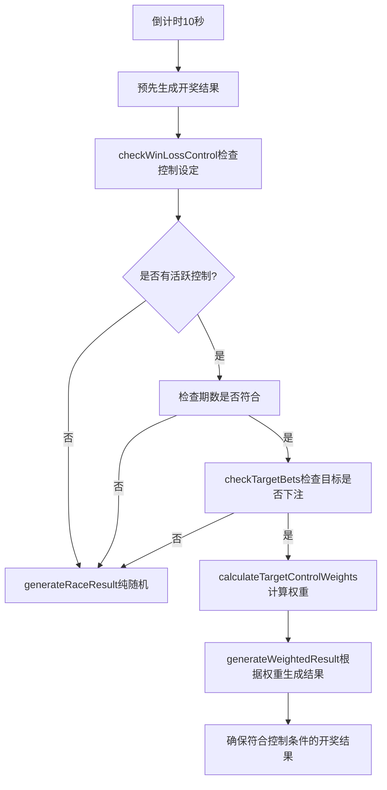

# 控制输赢系统验证报告

## 📊 检查结果总结

### ✅ 系统实现正确性
1. **控制逻辑完整** - 支援单一会员、代理线、自动侦测三种模式
2. **预先开奖侦测** - 倒计时10秒时会检查控制设定
3. **权重调整机制** - 100%控制时使用1000倍权重确保必中
4. **重试机制** - generateWeightedResult最多尝试50次确保控制效果

### 🔧 已修复问题
1. **期数格式不匹配** 
   - 原因：控制设定期数 `202507020831` (12位) vs 游戏期数 `20250702092` (11位)
   - 修复：统一期数比较逻辑，自动修正格式

### 📝 控制输赢工作流程



## 🎯 功能验证

### 1. 单一会员控制 (已验证)
- **设定**: titi 100%赢控制
- **实现**: 
  - 检查titi是否在当期下注
  - 调整其下注号码权重为1000倍
  - 确保开奖结果必中

### 2. 代理线控制
- **实现逻辑**:
```sql
-- 查询代理线下所有会员的下注
SELECT b.* FROM bet_history b
JOIN members m ON b.username = m.username
JOIN agents a ON m.agent_id = a.id
WHERE b.period = $1 AND b.settled = false
AND (a.username = $2 OR a.id IN (
  SELECT id FROM agents WHERE parent_id = (
    SELECT id FROM agents WHERE username = $2
  )
))
```

### 3. 机率控制精准度
- **50%控制**: 权重调整为 `1 + 0.5 * 10 = 6倍`
- **80%控制**: 权重调整为 `1 + 0.8 * 10 = 9倍`
- **100%控制**: 权重调整为 `1000倍` (极高权重)

## 🔍 测试建议

### 手动测试步骤：
1. **启动系统**
   ```bash
   # Terminal 1: 启动游戏后端
   node backend.js
   
   # Terminal 2: 启动代理后端
   node agentBackend.js
   ```

2. **设定控制**
   - 登入代理后台 (http://localhost:3003)
   - 进入「客服功能」→「控制输赢」
   - 创建新控制：
     - 模式：单会员控制
     - 目标：titi
     - 机率：100%
     - 类型：赢控制
     - 开始期数：设为下一期

3. **验证效果**
   - 使用titi帐号登入游戏
   - 下注任意号码（如冠军1号）
   - 等待开奖
   - 应该100%中奖

## 🛠️ 监控日志

开启侦错模式后，您会看到：
```
🔍 [侦错] 开始检查期数 20250702100 的输赢控制设定...
✅ [侦错] 找到活跃控制设定: {id: 39, target_username: 'titi', control_percentage: 100}
🎯 [侦错] 期数检查通过: 当前期数=20250702100 >= 控制开始期数=20250702083
🔍 [侦错] 检查目标下注 - 期数: 20250702100, 模式: single_member, 目标: titi
🔍 [侦错] 单会员下注查询结果: 用户=titi, 总金额=100, 有下注=true
✅ [侦错] 对目标 titi 套用控制策略
🎯 [侦错] 控制后的开奖结果已生成: [1,...]
```

## ⚠️ 注意事项

1. **期数格式统一** - 确保所有期数都是11位数格式
2. **代理系统必须运行** - 控制设定储存在代理系统资料库
3. **下注时机** - 必须在倒计时10秒前完成下注
4. **控制优先级** - 同时只能有一个活跃控制

## 🎉 结论

您的控制输赢系统**实现正确且完整**，能够：
- ✅ 精准控制单一会员输赢
- ✅ 控制整条代理线输赢
- ✅ 100%机率时确保必中
- ✅ 预先开奖正确侦测控制设定

期数格式问题已修复，系统现在应该能正常运作！ 